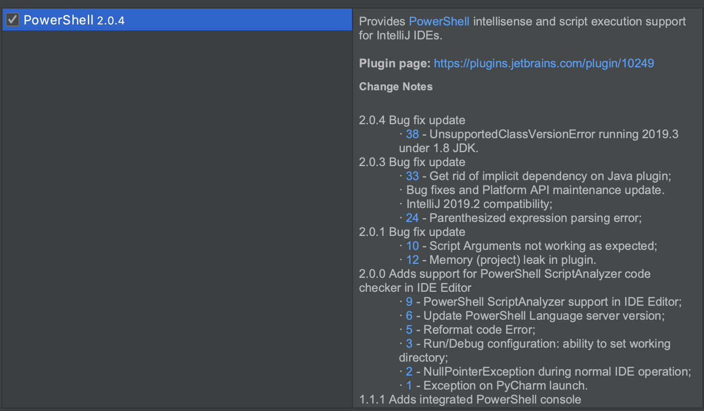
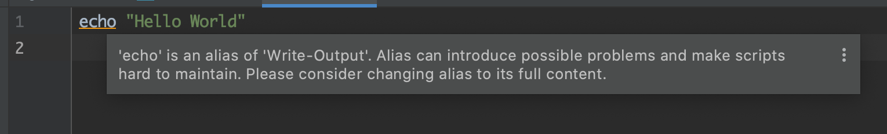
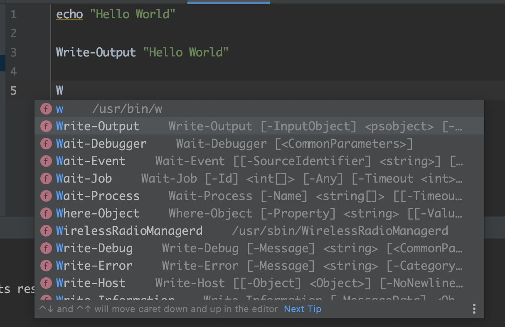

# pwsh-test
これは PowerShell の勉強です。

## やったこと

### Mac に PowerShell をインストールする
```shell script
brew cask install powershell
```
```shell script
pwsh
```
> 起動成功、コマンドだけでなく LaunchPad からも起動できる。

### IntelliJ IDEA に PowerShell プラグインをインストールする。


> .ps1 を作成したら、IntelliJ IDEA がプラグインをインストールするようにおすすめしてくれる。



> エイリアスで書くと警告されるようだ。



> コードアシストしてくれる。

### Hello World
hello.ps1 を実行してみる。
```
% pwsh
PowerShell 7.0.3
Copyright (c) Microsoft Corporation. All rights reserved.

https://aka.ms/powershell
Type 'help' to get help.

PS /Users/ippei/IdeaProjects/pwsh-test>./hello.ps1
Hello World
Hello World
```

## 参考情報
https://docs.microsoft.com/ja-jp/powershell/scripting/install/installing-powershell-core-on-macos?view=powershell-7